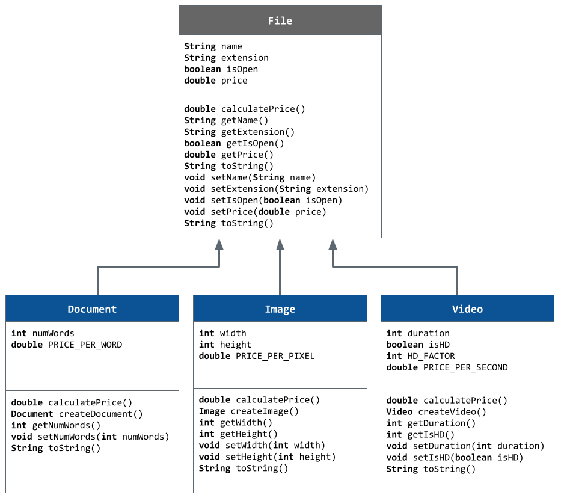

# Unit 2 - Store Management Project

## Introduction

You are opening a new business in your community! Businesses often need programs to manage the products and services they offer and track orders and requests from customers. Your goal is to create a store management system for your business.

## Requirements

Use your knowledge of object-oriented programming and class structure and design to create your store management system:
- **Create a class hierarchy** – Develop a superclass that represents a product or service your business offers and one or more subclasses that extend the superclass to represent more specific types of products or services.
- **Declare instance variables** – Declare instance variables in the superclass that are shared with the subclasses and instance variables in the subclasses that are not shared with the superclass.
- **Write constructors** – Write no-argument and parameterized constructors in the superclass and subclasses. Subclass constructors use the super keyword to call the superclass constructor.
- **Implement accessor and mutator methods** – Write accessor and mutator methods for instance variables that should be accessible and/or modifiable from outside of the class.
- **Implement a toString() method** – Write toString() methods in the superclass and subclasses that return information about the state of an object.

## UML Diagram

## Description

For my project, I decided to make a satyrical store that sold "File" like a digital one. Since part of this project was to utilize *inheritance*, I thought that since there are different kinds of Files, I could use a File *superclass* and then make more specialized *subclasses* of a File, like Images or Videos. I was able to create *Accessor and Mutator methods* for my File, Document, Image, and Video classes to preserve the integrity by securing the *state* of the *instance variables*, which demostrates the object-oriented programing principle: *encapsulation*. I additionally created a calculatePrice method in the File class, and had each subclass *override* the method to have a different formula for the price to be used for each differnt File type. 

The way the user interacts with my app is that it will be given a series of questions about if it wants to purchase at the shop, what does it want to purchase, and then customizing the order for each File by setting the *attributes* of the File class. After the user finishes buying at the store, a receipt of the order is printed with the Files that the user purchased, and the total price.
